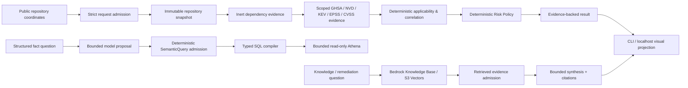

<div align="center">

🇺🇸 **English** &nbsp;|&nbsp; 🇧🇷 [Português](README.pt-br.md)

# OpsLens

### Verifiable Software Supply Chain & GenAI Architecture on AWS

**Deterministic vulnerability authority · Bedrock RAG · Hybrid Retrieval · Agentic AI · MCP · A2A · Security · Evaluation · Cost Engineering**

[](https://github.com/brunovicco/opslens/actions/workflows/codeql.yml)
[](https://github.com/brunovicco/opslens/actions/workflows/v1-demo-runner-ci.yml)
[](LICENSE)

</div>

OpsLens is an open-source AWS architecture lab for software-supply-chain intelligence built around one rule:

> **Agents reason. Code verifies evidence.**

It answers a practical question:

> Given the software actually used by a repository, which vulnerabilities materially affect it, what evidence proves that, and what should be prioritized?

The project separates probabilistic reasoning from deterministic authority. Models may classify, plan, route, summarize, or explain. Deterministic code owns package identity, version applicability, GHSA/NVD correlation, KEV/EPSS/CVSS evidence, risk policy, semantic-query admission, SQL compilation, evidence admission, tool authorization, and failure behavior.

> **Repository Risk != Runtime Exposure.**

## Try the V1 demo

The canonical reviewer path is local, synthetic, inert, and deterministic. No AWS credentials, live provider calls, model calls, or third-party repository-code execution are required after dependency installation.

**Prerequisites:** [uv](https://docs.astral.sh/uv/) 0.12.3 or newer. uv provisions Python 3.13 itself, so nothing else has to be installed first.

```bash
uv sync --frozen
uv run python scripts/demo_opslens.py --scenario material-vulnerability --format text
```

Run the localhost visual evidence viewer:

```bash
uv run python scripts/demo_opslens_web.py
```

Then open `http://127.0.0.1:8765/`.

The viewer binds structurally to loopback, exposes no `--host` option, loads no external browser assets, and consumes the same retained deterministic scenario results as the CLI.

### Three canonical scenarios

| Scenario | Deterministic outcome | What it proves |
| --- | --- | --- |
| `material-vulnerability` | `MATERIAL_FINDING`, Risk Policy v1 = **90 / P0** | Complete evidence can produce an actionable material finding. |
| `controlled-benign` | `NO_MATERIAL_FINDING` | No-finding is valid only with complete scoped fixture evidence; it is not a live-repository safety claim. |
| `fail-closed-incomplete-evidence` | `REJECTED_INCOMPLETE_EVIDENCE` | Incomplete identity stops before analysis/risk; missing evidence is never converted into benign evidence. |

Cross-scenario deterministic evaluation:

```bash
uv run python scripts/evaluate_opslens_demo.py --format text
```

The demo reports the run by default, so every admitted scenario exits `0`. Opt
into outcome semantics to use it from a pipeline, and add `--pretty` to read the
JSON projection without changing the identity it carries:

```bash
uv run python scripts/demo_opslens.py \
  --scenario material-vulnerability --format json --pretty --exit-code outcome
```

| `--exit-code outcome` | Meaning |
| ---: | --- |
| `0` | `NO_MATERIAL_FINDING` |
| `1` | `MATERIAL_FINDING` |
| `2` | `REJECTED_INCOMPLETE_EVIDENCE`, or an admission rejection |

`--pretty` reindents the canonical bytes. It never recomputes a digest, so
`projection != identity` holds in the CLI exactly as it does in the viewer.

See [Demo](docs/demo/README.md), [Scenarios](docs/demo/SCENARIOS.md), and the [3–5 minute walkthrough](docs/demo/WALKTHROUGH.md).

## Architecture at a glance



The model can propose or explain. It cannot authorize source truth, vulnerability applicability, risk truth, arbitrary SQL, tool execution, or missing-evidence semantics.

## Authority model

| Concern | Deterministic code | Model / agent |
| --- | --- | --- |
| Repository and package identity | **Authoritative** | No authority |
| Version applicability and GHSA/NVD correlation | **Authoritative** | May explain admitted result |
| KEV / EPSS / CVSS provenance | **Authoritative** | May summarize |
| Risk score / tier | **Authoritative** | May explain, never override |
| Semantic query / SQL execution | Admission + typed compilation | May propose bounded intent |
| Retrieval / citations | Evidence admission | May synthesize over admitted evidence |
| Capability / tool use | Authorization and limits | May request/propose |
| Visual demo | Existing result is authoritative | No model execution in V1 |

```text
model proposal != authorization
visual projection != business authority
missing evidence != benign evidence
```

## Security and failure model

OpsLens treats repository content as untrusted data.

```text
READ, NEVER EXECUTE third-party repository code.
```

Repository analysis never runs package managers, builds, tests, setup hooks, Dockerfiles, workflows, or repository scripts. Important fail-closed boundaries include invalid package/version identity, out-of-scope threat evidence, unrelated NVD evidence, malformed semantic plans, unauthorized capabilities, and incomplete evidence.

The repository also retains full-SHA GitHub Actions pinning, Dependency Review, CodeQL, least-privilege IAM evidence, content-minimized telemetry, adversarial authority regression, and explicit execution/cost limits.

## Measured evidence, not production claims

The retained Phase 19 representative workload measured:

| Metric | Evidence |
| --- | ---: |
| End-to-end duration | 17,748 ms |
| Serialized result | 5,285 bytes |
| GitHub physical HTTP requests | 4 MEASURED |
| Bedrock Retrieve calls | 1 MEASURED |
| Bedrock Retrieve client elapsed | 4,148 ms MEASURED |
| Bedrock model calls | 1 MEASURED |
| Bedrock input / output tokens | 5,936 / 408 MEASURED |
| Bedrock model client elapsed | 8,901 ms MEASURED |
| Bedrock provider latency | 7,772 ms MEASURED |
| Retries | 0 MEASURED |
| Throttle count | UNMEASURED |

These values support architecture and cost discussions; they are **not** production SLO, SLA, throughput, or TCO claims. See [Portfolio Evidence](docs/portfolio-evidence.md).

## Retained AWS runtime evidence

The selected async topology is retained as deployment evidence:

```text
HTTP API -> API Lambda -> DynamoDB job/idempotency authority
                         -> SQS -> Lambda worker -> DynamoDB result
                                  -> SQS DLQ
```

Gate 19.7 materialized 21 managed resources and proved Terraform convergence, while keeping the public endpoint, submit path, worker, and event-source mapping disabled.

```text
materialized != enabled
demonstration readiness != production readiness
```

## V1 status and scope

**Phases 0–18 are complete.** Phase 19 is the final V1 closeout phase. The canonical CLI, three deterministic scenarios, regression evaluator, and localhost visual demo are complete; final portfolio/release closeout remains.

The retained historical phase name is **Phase 19 — Bounded Public Runtime & Productization**. V1 deliberately narrows completion to a demonstration and architecture lab rather than a production SaaS.

V1 does not require an Internet-facing production runtime, OIDC/Cognito, multi-tenancy, WAF, custom domain, commercial quotas/billing, production SLO/SLA, HA/DR, production TCO, or public worker enablement.

### Retained Phase 19 decision markers

These lines are intentionally retained as historical evidence and verifier compatibility markers:

```text
19.1  Public Runtime Hypothesis & Launch Contract       COMPLETE
historical decision: DEFERRED_PENDING_MEASUREMENT
19.2  Representative Workload Measurement              COMPLETE
ASYNC_SUBMIT_STATUS_RESULT
```

The pending-measurement state is historical; later gates supplied the measurement, selected the async interaction pattern, materialized the disabled runtime, and then established the V1 offline demonstration path.

## What the project demonstrates

- immutable public-repository and dependency evidence;
- source-preserving NVD, GitHub Advisory, CISA KEV, and FIRST EPSS handling;
- deterministic PyPI/PEP 440 applicability and risk prioritization;
- bounded semantic planning with deterministic SQL compilation;
- Bedrock Knowledge Bases, S3 Vectors, hybrid retrieval, grounded synthesis and citations;
- measured single-agent and multi-agent experiments with simpler-topology decisions when quality did not improve;
- MCP, A2A, AgentCore, and Inspector experiments behind explicit authority boundaries;
- observability, evaluation, cost semantics, adversarial regression, immutable artifacts, Terraform planning, and fail-closed controls.

## Documentation

- [Current State](docs/current-state.md)
- [Roadmap](docs/roadmap.md)
- [Architecture](docs/architecture.md)
- [Portfolio Evidence](docs/portfolio-evidence.md)
- [V1 Demonstration Scope](docs/v1-demonstration-scope.md)
- [V1 Completion Checklist](docs/v1-completion-checklist.md)
- [Demo Walkthrough](docs/demo/WALKTHROUGH.md)
- [Portfolio Capture Guide](docs/demo/PORTFOLIO_CAPTURE.md)
- [AIP-C01 Learning Map](docs/aip-c01-learning-map.md)
- [Architecture Decision Records](docs/adr/README.md)

## Permanent engineering rules

```text
Agents reason. Code verifies evidence.
Not every question is a RAG problem.
Structured facts use structured retrieval.
No unrestricted text-to-SQL.
READ, NEVER EXECUTE third-party repository code.
Repository Risk != Runtime Exposure.
retrieved content != instruction authority
model proposal != authorization
tool/protocol success != business truth
historical evidence != standing authority
missing evidence != benign evidence
MEASURED != DERIVED
UNMEASURED != zero
NOT_APPLICABLE != zero
configured limit != measured utilization
artifact hash != S3 VersionId
publication success != deployment authorization
plan != apply
materialized != enabled
visual projection != business authority
localhost demo != public service
demonstration readiness != production readiness
AIP-C01 topic != product requirement
```

## License

Apache License 2.0.
