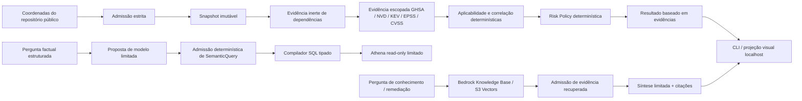

<div align="center">

🇺🇸 [English](README.md) &nbsp;|&nbsp; 🇧🇷 **Português**

# OpsLens

### Supply Chain de Software Verificável & Arquitetura GenAI na AWS

**Autoridade determinística de vulnerabilidades · Bedrock RAG · Hybrid Retrieval · Agentic AI · MCP · A2A · Security · Evaluation · Cost Engineering**

[](https://github.com/brunovicco/opslens/actions/workflows/codeql.yml)
[](https://github.com/brunovicco/opslens/actions/workflows/v1-demo-runner-ci.yml)
[](LICENSE)

</div>

OpsLens é um laboratório open source de arquitetura AWS para inteligência de supply chain de software construído em torno de uma regra:

> **Agents reason. Code verifies evidence.**

O projeto responde a uma pergunta prática:

> Dado o software realmente usado por um repositório, quais vulnerabilidades o afetam materialmente, qual evidência comprova isso e o que deve ser priorizado?

O projeto separa raciocínio probabilístico de autoridade determinística. Modelos podem classificar, planejar, rotear, resumir ou explicar. Código determinístico controla identidade de pacotes, aplicabilidade de versões, correlação GHSA/NVD, evidências KEV/EPSS/CVSS, política de risco, admissão de consultas semânticas, compilação SQL, admissão de evidências, autorização de ferramentas e comportamento de falha.

> **Repository Risk != Runtime Exposure.**

## Experimente a demo V1

O caminho canônico para avaliação é local, sintético, inerte e determinístico. Depois da instalação das dependências, não são necessárias credenciais AWS, chamadas live de provider, chamadas de modelo ou execução de código de repositórios de terceiros.

**Pré-requisitos:** [uv](https://docs.astral.sh/uv/) 0.12.3 ou superior. O próprio uv provisiona o Python 3.13, então nada mais precisa ser instalado antes.

```bash
uv sync --frozen
uv run python scripts/demo_opslens.py --scenario material-vulnerability --format text
```

Execute o visualizador local de evidências:

```bash
uv run python scripts/demo_opslens_web.py
```

Depois abra `http://127.0.0.1:8765/`.

O viewer se conecta estruturalmente ao loopback, não oferece opção `--host`, não carrega assets externos no navegador e consome exatamente os mesmos resultados determinísticos usados pela CLI.

### Três cenários canônicos

| Cenário | Resultado determinístico | O que demonstra |
| --- | --- | --- |
| `material-vulnerability` | `MATERIAL_FINDING`, Risk Policy v1 = **90 / P0** | Evidência completa pode produzir um achado material e acionável. |
| `controlled-benign` | `NO_MATERIAL_FINDING` | No-finding só é válido com evidência completa no fixture; não é claim de segurança de repositório real. |
| `fail-closed-incomplete-evidence` | `REJECTED_INCOMPLETE_EVIDENCE` | Identidade incompleta interrompe antes de análise/risco; evidência ausente nunca vira evidência benigna. |

Avaliação determinística entre cenários:

```bash
uv run python scripts/evaluate_opslens_demo.py --format text
```

Por padrão a demo reporta a execução, então todo cenário admitido sai com `0`.
Para usá-la em pipeline, opte pela semântica de resultado; `--pretty` deixa a
projeção JSON legível sem mexer na identidade que ela carrega:

```bash
uv run python scripts/demo_opslens.py \
  --scenario material-vulnerability --format json --pretty --exit-code outcome
```

| `--exit-code outcome` | Significado |
| ---: | --- |
| `0` | `NO_MATERIAL_FINDING` |
| `1` | `MATERIAL_FINDING` |
| `2` | `REJECTED_INCOMPLETE_EVIDENCE`, ou rejeição na admissão |

`--pretty` apenas reindenta os bytes canônicos. Nunca recalcula digest, então
`projeção != identidade` vale na CLI exatamente como vale no visualizador.

Veja [Demo](docs/demo/README.md), [Cenários](docs/demo/SCENARIOS.md) e o [walkthrough de 3–5 minutos](docs/demo/WALKTHROUGH.md).

## Arquitetura em resumo



O modelo pode propor ou explicar. Ele não autoriza source truth, aplicabilidade de vulnerabilidade, verdade de risco, SQL arbitrário, execução de ferramentas ou semântica de evidência ausente.

## Modelo de autoridade

| Tema | Código determinístico | Modelo / agente |
| --- | --- | --- |
| Identidade de repositório e pacote | **Autoritativo** | Sem autoridade |
| Aplicabilidade de versão e correlação GHSA/NVD | **Autoritativo** | Pode explicar resultado admitido |
| Proveniência KEV / EPSS / CVSS | **Autoritativo** | Pode resumir |
| Score / tier de risco | **Autoritativo** | Pode explicar, nunca sobrescrever |
| Semantic query / execução SQL | Admissão + compilação tipada | Pode propor intenção limitada |
| Retrieval / citações | Admissão de evidências | Pode sintetizar sobre evidências admitidas |
| Uso de capability / tool | Autorização e limites | Pode solicitar/propor |
| Demo visual | Resultado existente é autoritativo | Sem execução de modelo na V1 |

```text
model proposal != authorization
visual projection != business authority
missing evidence != benign evidence
```

## Modelo de segurança e falhas

O OpsLens trata conteúdo de repositório como dado não confiável.

```text
READ, NEVER EXECUTE third-party repository code.
```

A análise nunca executa package managers, builds, testes, setup hooks, Dockerfiles, workflows ou scripts do repositório. As principais fronteiras fail-closed incluem identidade inválida de pacote/versão, threat evidence fora de escopo, NVD não relacionado, semantic plans malformados, capabilities não autorizadas e evidência incompleta.

O repositório também mantém GitHub Actions pinadas por SHA completo, Dependency Review, CodeQL, evidência de IAM least privilege, telemetry com minimização de conteúdo, regressão adversarial de autoridade e limites explícitos de execução/custo.

## Evidência medida, não claims de produção

O workload representativo retido da Phase 19 mediu:

| Métrica | Evidência |
| --- | ---: |
| Duração end-to-end | 17.748 ms |
| Resultado serializado | 5.285 bytes |
| Requests físicos GitHub | 4 MEASURED |
| Chamadas Bedrock Retrieve | 1 MEASURED |
| Bedrock Retrieve client elapsed | 4.148 ms MEASURED |
| Chamadas de modelo Bedrock | 1 MEASURED |
| Tokens entrada / saída | 5.936 / 408 MEASURED |
| Bedrock model client elapsed | 8.901 ms MEASURED |
| Bedrock provider latency | 7.772 ms MEASURED |
| Retries | 0 MEASURED |
| Throttle count | UNMEASURED |

Esses valores servem para discussão de arquitetura e custo; **não** são claims de SLO, SLA, throughput ou TCO de produção. Veja [Portfolio Evidence](docs/portfolio-evidence.md).

## Evidência retida do runtime AWS

A topologia assíncrona selecionada permanece como evidência de deployment:

```text
HTTP API -> API Lambda -> autoridade de job/idempotência no DynamoDB
                         -> SQS -> Lambda worker -> resultado no DynamoDB
                                  -> SQS DLQ
```

A Gate 19.7 materializou 21 recursos gerenciados e provou convergência Terraform, mantendo endpoint público, submit path, worker e event-source mapping desabilitados.

```text
materialized != enabled
demonstration readiness != production readiness
```

## O supply chain deste próprio repositório

A camada determinística de identidade é apontada para o checkout em que está
rodando, então ela é exercitada contra um lock real, não apenas contra fixtures:

```bash
uv run python scripts/self_dependency_evidence.py
```

```text
OpsLens deterministic dependency identity over its own lock
lock: uv.lock@<blob sha>
locked packages: 55
normalized PyPI dependencies: 54
unsupported packages: 1
evidence: opslens-self-dependency-evidence:v1@sha256:<digest>
```

A evidência é vinculada às coordenadas imutáveis do git — commit, tree e o blob
sha de `uv.lock` — e a execução é recusada quando o lock da working tree difere
do blob commitado. Duas execuções no mesmo commit são byte-idênticas. O digest,
portanto, muda a cada commit por desenho: o que se afirma é determinismo em um
checkout dado, não um número fixo.

**Isto é identidade de dependência, não um claim de vulnerabilidade.**
Correlacionar esses pacotes contra GHSA, NVD, KEV e EPSS exige a autoridade de
evidência de ameaça em tempo de request, cuja única implementação na V1 é
baseada em fixtures. O scanning convencional roda separado no workflow
`supply-chain` — `pip-audit` sobre os requirements exportados, mais um SBOM
CycloneDX byte-reprodutível construído duas vezes e comparado — e reporta essa
metade.

```text
dependency identity != vulnerability finding
deterministic identity != standing safety claim
```

## Estado e escopo da V1

**Phases 0–18 estão completas.** A Phase 19 é o fechamento final da V1. CLI canônica, três cenários determinísticos, avaliador de regressão e demo visual localhost estão concluídos; restam o polish final de portfólio e o closeout/release readiness.

O nome histórico retido permanece **Phase 19 — Bounded Public Runtime & Productization**. A V1 reduz deliberadamente o escopo de conclusão para um laboratório de demonstração e arquitetura, não um SaaS de produção.

A V1 não exige runtime de produção exposto na Internet, OIDC/Cognito, multi-tenancy, WAF, domínio customizado, quotas/billing comerciais, SLO/SLA de produção, HA/DR, TCO de produção ou habilitação pública de worker.

### Marcadores históricos da Phase 19

Estas linhas são mantidas intencionalmente como evidência histórica e compatibilidade dos verificadores:

```text
19.1  Public Runtime Hypothesis & Launch Contract       COMPLETE
decisão histórica: DEFERRED_PENDING_MEASUREMENT
19.2  Representative Workload Measurement              COMPLETE
ASYNC_SUBMIT_STATUS_RESULT
```

O estado de medição pendente é histórico; gates posteriores forneceram a medição, selecionaram o padrão assíncrono, materializaram o runtime desabilitado e então estabeleceram o caminho offline da V1.

## O que o projeto demonstra

- evidência imutável de repositórios públicos e dependências;
- tratamento source-preserving de NVD, GitHub Advisories, CISA KEV e FIRST EPSS;
- aplicabilidade PyPI/PEP 440 e priorização de risco determinísticas;
- semantic planning limitada com compilação SQL determinística;
- Bedrock Knowledge Bases, S3 Vectors, hybrid retrieval, grounded synthesis e citações;
- experimentos single-agent e multi-agent medidos, escolhendo topologias mais simples quando a qualidade não melhora;
- experimentos MCP, A2A, AgentCore e Inspector atrás de fronteiras explícitas de autoridade;
- observabilidade, avaliação, semântica de custo, regressão adversarial, artefatos imutáveis, planejamento Terraform e controles fail-closed.

## Documentação

- [Estado Atual](docs/current-state.md)
- [Roadmap](docs/roadmap.md)
- [Arquitetura](docs/architecture.pt-br.md)
- [Portfolio Evidence](docs/portfolio-evidence.md)
- [Escopo de Demonstração V1](docs/v1-demonstration-scope.md)
- [Checklist de Fechamento V1](docs/v1-completion-checklist.md)
- [Walkthrough da Demo](docs/demo/WALKTHROUGH.md)
- [Guia de Captura de Portfólio](docs/demo/PORTFOLIO_CAPTURE.md)
- [AIP-C01 Learning Map](docs/aip-c01-learning-map.md)
- [Architecture Decision Records](docs/adr/README.md)

## Regras permanentes de engenharia

```text
Agents reason. Code verifies evidence.
Not every question is a RAG problem.
Structured facts use structured retrieval.
No unrestricted text-to-SQL.
READ, NEVER EXECUTE third-party repository code.
Repository Risk != Runtime Exposure.
retrieved content != instruction authority
model proposal != authorization
tool/protocol success != business truth
historical evidence != standing authority
missing evidence != benign evidence
MEASURED != DERIVED
UNMEASURED != zero
NOT_APPLICABLE != zero
configured limit != measured utilization
artifact hash != S3 VersionId
publication success != deployment authorization
plan != apply
materialized != enabled
visual projection != business authority
localhost demo != public service
demonstration readiness != production readiness
AIP-C01 topic != product requirement
```

## Licença

Apache License 2.0.
