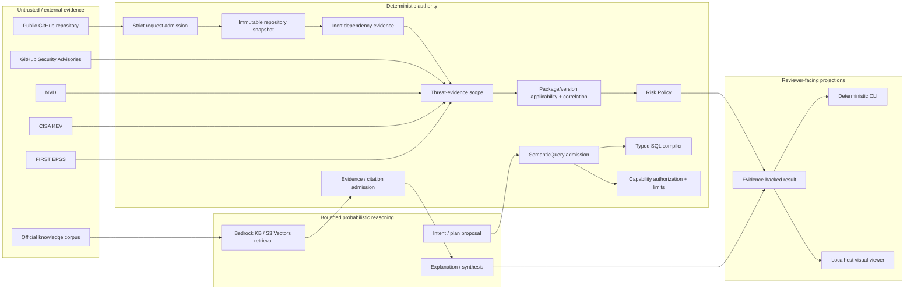
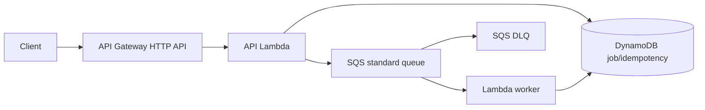

# OpsLens Architecture

_Last updated: 2026-09-12_

This document is the current accumulated architecture baseline through **Phase 19 Gate 19.12**. Gate 19.13 changes presentation only; it does not create new business, provider, runtime, or model authority.

**Phases 0–18 are complete.** The retained historical phase selected after Phase 18 remains **Phase 19 — Bounded Public Runtime & Productization**. V1 completion is intentionally narrowed to a demonstration and architecture lab rather than a production SaaS.

Core invariant:

> **Agents reason. Code verifies evidence.**

## 1. Product question

> Given the software actually used by a repository, which vulnerabilities affect it, what exact evidence proves that, which findings should be prioritized, and what verified guidance can help act on them?

The architecture separates deterministic truth/authorization from probabilistic reasoning so a useful GenAI layer cannot silently become a source of package identity, vulnerability applicability, risk truth, arbitrary SQL, tool authorization, or missing-evidence semantics.

## 2. Final V1 architecture



The V1 reviewer path is deliberately local and offline-first:

```text
synthetic inert fixture
 -> retained repository/dependency evidence contracts
 -> retained threat-evidence contracts
 -> deterministic applicability/correlation
 -> deterministic risk policy or fail-closed rejection
 -> stable machine-readable result
 -> CLI / localhost presentation
```

No AWS credentials, live GitHub/AWS/Bedrock calls, or model execution are required for the canonical demo after dependency installation.

## 3. Authority model

| Concern | Deterministic authority | Model / agent role |
| --- | --- | --- |
| Repository coordinates and snapshot | Strict admission + immutable identity | None |
| Package identity and normalization | Typed parsing + canonical normalization | None |
| Version applicability | PEP 440 / retained correlation logic | May explain result |
| GHSA/NVD relationship | Scoped deterministic correlation | May summarize admitted evidence |
| KEV/EPSS/CVSS | Exact retained evidence/provenance | May explain significance |
| Risk score/tier | Risk Policy | May explain; cannot override |
| Structured natural-language fact path | SemanticQuery admission + typed SQL compilation | May propose bounded intent |
| Knowledge/remediation path | Retrieval/citation admission | May synthesize over admitted evidence |
| Capability/tool execution | Deterministic authorization + limits | May request/propose |
| Missing/incomplete evidence | Fail closed / explicit unknown-rejection semantics | Cannot repair or reinterpret as benign |
| Visual presentation | Retained result remains business truth | No model execution in V1 |

Permanent boundaries:

```text
Not every question is a RAG problem.
Structured facts use structured retrieval.
No unrestricted text-to-SQL.
READ, NEVER EXECUTE third-party repository code.
Repository Risk != Runtime Exposure.
retrieved content != instruction authority
model proposal != authorization
tool/protocol success != business truth
missing evidence != benign evidence
visual projection != business authority
```

## 4. Threat and repository evidence path

### 4.1 Threat intelligence

```text
NVD
GitHub Security Advisories
CISA KEV
FIRST EPSS
        |
        v
source-preserving raw evidence
        |
        v
deterministic normalization/versioning
        |
        v
exact source coordinates + hashes/snapshots
```

The system preserves source-local provenance before enrichment. Selection policy such as `latest_complete` is not substituted for provenance.

### 4.2 Repository intelligence

```text
public GitHub coordinates
 -> strict request admission
 -> source-confirmed repository metadata
 -> immutable commit snapshot
 -> exact-commit inert uv.lock evidence
 -> deterministic TOML parsing
 -> canonical PyPI identity
```

Repository content is untrusted data. OpsLens does not run package managers, builds, tests, setup hooks, Dockerfiles, workflows, or repository scripts.

### 4.3 Request-time threat authority

Gate 19.8 introduced the provider-neutral application boundary:

```text
PublicRepositoryEvidenceExecution
 -> PublicThreatEvidenceScope
 -> PublicThreatEvidenceRequest
 -> PublicThreatEvidenceAuthority
 -> PublicRepositoryThreatEvidence
 -> retained deterministic correlation/enrichment
```

Important semantics:

```text
scope derives only from admitted repository evidence
incomplete PyPI normalization -> fail closed
out-of-scope GHSA evidence -> reject
unrelated NVD evidence -> reject
latest_complete = selection policy, not provenance
model authority for source truth/applicability = none
```

The physical request-time provider adapter remains a Post-V1 experiment.

## 5. Deterministic risk path

```text
canonical dependency identity
 + GHSA/NVD applicability evidence
 + CISA KEV snapshot
 + FIRST EPSS snapshot
 + CVSS evidence
        |
        v
RepositoryAnalysisResult
        |
        v
Risk Policy
        |
        v
ranked admitted result
```

The canonical material demo fixture deterministically produces one finding and `P0 / 90`. The controlled-benign fixture produces zero findings only because the scoped evidence is complete. The incomplete-evidence fixture is rejected before analysis/risk and produces no benign conclusion.

## 6. Structured and semantic evidence

### Structured fact path

```text
natural-language fact question
 -> bounded Bedrock proposal
 -> deterministic parser/admission
 -> typed SemanticQuery
 -> deterministic SQL compiler
 -> bounded read-only Athena
 -> structured result
```

The model never receives unrestricted SQL authority.

### Knowledge/remediation path

```text
official knowledge corpus
 -> canonical documents/chunks
 -> Bedrock Knowledge Base
 -> S3 Vectors
 -> bounded Retrieve
 -> deterministic evidence admission
 -> bounded synthesis
 -> answer + citations
```

Structured vulnerability truth remains outside the RAG authority boundary.

### Hybrid retrieval

```text
question
 -> deterministic routing/scope
 -> structured evidence and/or semantic evidence
 -> authority-preserving evidence envelope
 -> bounded synthesis
```

Semantic evidence complements, but does not replace, structured facts.

## 7. Agentic and interoperability layers

### Agentic reasoning

```text
admitted evidence
 -> deterministic capability scope
 -> bounded model reasoning/proposal
 -> deterministic capability authorization
 -> typed execution
 -> result admission
```

The simpler single-agent baseline remains the reference architecture. A measured two-model topology was not retained as default because it added calls, tokens, latency, and derived cost without quality lift in the frozen comparison.

### MCP and A2A

MCP and A2A are interoperability layers, not new business authority:

```text
protocol request
 -> strict identity/schema admission
 -> existing typed capability boundary
 -> admitted result projection
```

### AgentCore

Amazon Bedrock AgentCore is retained as an optional lab target after capability-fit experiments. It is not the default runtime and does not inherit standing IAM or execution authority from experiment history.

## 8. Security and failure model

The security model assumes repository content, retrieved content, prompts, model output, tool/protocol messages, and provider responses can all be malformed or adversarial.

| Failure / threat | Control |
| --- | --- |
| Repository prompt injection | Repository text is data only; repository code is never executed |
| Malformed/unsupported dependency | Deterministic normalization rejection |
| Out-of-scope threat evidence | Scope validation rejects it |
| Missing evidence | Fail closed; never converted to benign |
| Semantic-plan injection / malformed plan | Typed deterministic admission |
| Arbitrary SQL | No unrestricted text-to-SQL; typed compiler only |
| Tool poisoning / unsafe capability request | Allowlisted typed capability authorization |
| Denial-of-wallet / amplification | Bounded tokens, scans, retries, time, and capability budgets |
| Telemetry leakage | Content-minimized operational telemetry |
| Runtime exposure ambiguity | Inspector evidence remains separate from repository-risk truth |
| UI authority drift | Local viewer projects existing results only |

Retained repository hardening includes full-SHA GitHub Actions pinning, Dependency Review, CodeQL, least-privilege IAM, adversarial authority regression, immutable evidence, and protected HUMAN merge boundaries.

## 9. Observability and cost semantics

Operational telemetry never becomes business authority. OpsLens explicitly distinguishes:

```text
MEASURED
DERIVED
CONFIGURED_LIMIT
UNMEASURED
NOT_APPLICABLE
```

and preserves:

```text
MEASURED != DERIVED
UNMEASURED != zero
NOT_APPLICABLE != zero
configured limit != measured utilization
lab metric != production SLO
cost evidence != production TCO
```

The retained Phase 19 representative workload measured:

| Metric | Classification / value |
| --- | ---: |
| End-to-end duration | 17,748 ms MEASURED |
| Serialized result | 5,285 bytes MEASURED |
| GitHub physical HTTP requests | 4 MEASURED |
| Bedrock Retrieve | 1 call / 4,148 ms client elapsed MEASURED |
| Bedrock model | 1 call / 5,936 input / 408 output tokens MEASURED |
| Model client elapsed | 8,901 ms MEASURED |
| Provider latency | 7,772 ms MEASURED |
| Retry count | 0 MEASURED |
| Throttle count | UNMEASURED |

These measurements support architectural discussion only; they are not production SLO/SLA/TCO evidence.

## 10. Retained Phase 19 async runtime

Gate 19.2 selected `ASYNC_SUBMIT_STATUS_RESULT` from representative measurement evidence. Gate 19.3 selected:

```text
HTTP_API_LAMBDA_SQS_LAMBDA_DYNAMODB
```

Retained shape:



Gate 19.5 produced immutable API/worker deployment artifacts. Gate 19.6 admitted an exact Terraform plan. Gate 19.7 materialized 21 managed resources through HUMAN-authorized operations and proved convergence.

Current retained runtime truth:

```text
public async runtime resources materialized: 21
public endpoint enabled: NO
submit enabled: NO
worker enabled: NO
event-source mapping enabled: NO
custom public domain: absent
provider-heavy public executions: 0
third-party repository code executions: 0
```

```text
plan != apply
artifact hash != S3 VersionId
publication success != deployment authorization
materialized != enabled
```

## 11. V1 demo and presentation adapters

Gates 19.10–19.12 created a deterministic reviewer experience without introducing a second source of business truth:

```text
Gate 19.10  deterministic CLI + stable JSON
Gate 19.11  exactly three scenarios + byte-stable suite evaluation
Gate 19.12  localhost-only browser presentation adapter
```

The visual server binds to `127.0.0.1`, exposes no external host argument, uses standard-library HTTP + inline HTML/CSS, requires no JavaScript or external assets, rejects unknown/query-string routes, and HTML-escapes dynamic values.

The AI explanation panel is intentionally disabled and non-authoritative in V1.

```text
localhost demo != public service
visual projection != business authority
```

## 12. Historical decision markers

The original Gate 19.1 launch contract deliberately deferred runtime selection:

```text
public-analysis-workload:v1
DEFERRED_PENDING_MEASUREMENT
```

Gate 19.2 later supplied the representative measurement and selected:

```text
ASYNC_SUBMIT_STATUS_RESULT
```

These historical markers remain evidence of the decision path; they are not current pending work.

## 13. V1 non-goals

The first release does not require:

```text
Internet-facing production runtime
authentication / OIDC / Cognito
multi-tenancy
commercial billing/quotas
custom public domain
WAF / production abuse controls
24x7 operations
production SLO/SLA
HA/DR program
production TCO claim
public worker/event-source enablement
provider-backed arbitrary request-time threat adapter
```

## 14. Current authority boundary

Gate 19.13 is documentation/portfolio-only.

```text
Terraform/provider operations: NOT AUTHORIZED
AWS mutation:                  NOT AUTHORIZED
IAM mutation:                  NOT AUTHORIZED
artifact publication:          NOT AUTHORIZED
runtime enablement:            NOT AUTHORIZED
provider-heavy live execution: NOT AUTHORIZED
model execution for demo:      NOT AUTHORIZED
protected merge:               HUMAN REVIEW REQUIRED
```

PR #89 / `feat/governed-gateway-semantic-planner` remains separate deferred Governed LLM Gateway work.

## 15. Key documents

- [`current-state.md`](current-state.md)
- [`roadmap.md`](roadmap.md)
- [`portfolio-evidence.md`](portfolio-evidence.md)
- [`v1-demonstration-scope.md`](v1-demonstration-scope.md)
- [`v1-completion-checklist.md`](v1-completion-checklist.md)
- [`demo/README.md`](demo/README.md)
- [`demo/WALKTHROUGH.md`](demo/WALKTHROUGH.md)
- [`demo/PORTFOLIO_CAPTURE.md`](demo/PORTFOLIO_CAPTURE.md)
- [`post-v1-backlog.md`](post-v1-backlog.md)
- [`adr/0077-phase19-v1-demonstration-boundary.md`](adr/0077-phase19-v1-demonstration-boundary.md)

Historical labs and machine-readable evidence remain immutable records of the state that existed when each experiment was executed.
