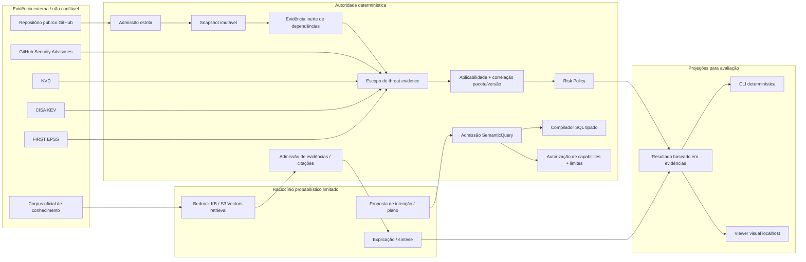
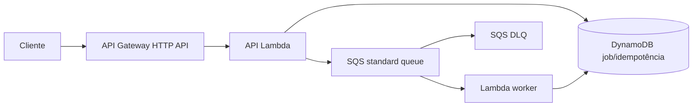

# Arquitetura do OpsLens

_Última atualização: 2026-09-12_

Este documento é o baseline arquitetural acumulado até a **Phase 19 Gate 19.12**. A Gate 19.13 altera somente a apresentação; não cria nova autoridade de negócio, provider, runtime ou modelo.

**As Phases 0–18 estão completas.** A fase historicamente selecionada após a Phase 18 permanece **Phase 19 — Bounded Public Runtime & Productization**. A conclusão da V1 é deliberadamente reduzida a um laboratório de demonstração e arquitetura, não a um SaaS de produção.

Invariante central:

> **Agents reason. Code verifies evidence.**

## 1. Pergunta do produto

> Dado o software realmente usado por um repositório, quais vulnerabilidades o afetam, qual evidência exata comprova isso, quais achados devem ser priorizados e qual orientação verificada pode ajudar na ação?

A arquitetura separa verdade/autorização determinística de raciocínio probabilístico para que uma camada GenAI útil não se transforme silenciosamente em fonte de identidade de pacote, aplicabilidade de vulnerabilidade, verdade de risco, SQL arbitrário, autorização de tools ou semântica de evidência ausente.

## 2. Arquitetura final da V1



O caminho canônico da V1 é propositalmente local e offline-first:

```text
fixture sintético e inerte
 -> contratos retidos de evidência de repositório/dependência
 -> contratos retidos de threat evidence
 -> aplicabilidade/correlação determinísticas
 -> risk policy determinística ou rejeição fail-closed
 -> resultado machine-readable estável
 -> apresentação CLI / localhost
```

Depois da instalação das dependências, a demo canônica não exige credenciais AWS, chamadas live de GitHub/AWS/Bedrock nem execução de modelo.

## 3. Modelo de autoridade

| Tema | Autoridade determinística | Papel de modelo / agente |
| --- | --- | --- |
| Coordenadas e snapshot do repositório | Admissão estrita + identidade imutável | Nenhum |
| Identidade e normalização de pacotes | Parsing tipado + normalização canônica | Nenhum |
| Aplicabilidade de versões | PEP 440 / lógica de correlação retida | Pode explicar o resultado |
| Relação GHSA/NVD | Correlação determinística escopada | Pode resumir evidência admitida |
| KEV/EPSS/CVSS | Evidência/proveniência exata | Pode explicar significado |
| Score/tier de risco | Risk Policy | Pode explicar; não pode sobrescrever |
| Caminho factual em linguagem natural | Admissão SemanticQuery + compilação SQL tipada | Pode propor intenção limitada |
| Caminho de conhecimento/remediação | Admissão de retrieval/citações | Pode sintetizar sobre evidência admitida |
| Execução de capability/tool | Autorização determinística + limites | Pode solicitar/propor |
| Evidência ausente/incompleta | Fail closed / semântica explícita de rejeição | Não pode reparar nem reinterpretar como benigno |
| Apresentação visual | Resultado retido continua sendo verdade de negócio | Sem execução de modelo na V1 |

Fronteiras permanentes:

```text
Not every question is a RAG problem.
Structured facts use structured retrieval.
No unrestricted text-to-SQL.
READ, NEVER EXECUTE third-party repository code.
Repository Risk != Runtime Exposure.
retrieved content != instruction authority
model proposal != authorization
tool/protocol success != business truth
missing evidence != benign evidence
visual projection != business authority
```

## 4. Caminho de threat e repository evidence

### 4.1 Threat intelligence

```text
NVD
GitHub Security Advisories
CISA KEV
FIRST EPSS
        |
        v
evidência raw preservando a fonte
        |
        v
normalização/versionamento determinísticos
        |
        v
coordenadas exatas + hashes/snapshots
```

O sistema preserva proveniência source-local antes de enrichment. Política de seleção como `latest_complete` não substitui proveniência.

### 4.2 Repository intelligence

```text
coordenadas públicas GitHub
 -> admissão estrita
 -> metadata confirmada pela fonte
 -> snapshot de commit imutável
 -> evidência inerte de uv.lock no commit exato
 -> parsing TOML determinístico
 -> identidade PyPI canônica
```

Conteúdo do repositório é dado não confiável. O OpsLens não executa package managers, builds, testes, setup hooks, Dockerfiles, workflows ou scripts do repositório.

### 4.3 Autoridade de threat evidence em request-time

A Gate 19.8 introduziu a fronteira provider-neutral:

```text
PublicRepositoryEvidenceExecution
 -> PublicThreatEvidenceScope
 -> PublicThreatEvidenceRequest
 -> PublicThreatEvidenceAuthority
 -> PublicRepositoryThreatEvidence
 -> correlação/enriquecimento determinísticos retidos
```

Semânticas importantes:

```text
scope deriva apenas da evidência admitida do repositório
normalização PyPI incompleta -> fail closed
GHSA fora do scope -> rejeitar
NVD não relacionado -> rejeitar
latest_complete = política de seleção, não proveniência
autoridade do modelo sobre source truth/aplicabilidade = nenhuma
```

O adapter físico provider-backed para request-time permanece Post-V1.

## 5. Caminho determinístico de risco

```text
identidade canônica de dependência
 + evidência de aplicabilidade GHSA/NVD
 + snapshot CISA KEV
 + snapshot FIRST EPSS
 + evidência CVSS
        |
        v
RepositoryAnalysisResult
        |
        v
Risk Policy
        |
        v
resultado ranqueado admitido
```

O fixture material canônico produz deterministicamente um achado e `P0 / 90`. O fixture controlled-benign produz zero achados apenas porque a evidência escopada está completa. O fixture de evidência incompleta é rejeitado antes de análise/risco e não produz conclusão benigna.

## 6. Evidência estruturada e semântica

### Caminho factual estruturado

```text
pergunta factual em linguagem natural
 -> proposta Bedrock limitada
 -> parser/admissão determinísticos
 -> SemanticQuery tipada
 -> compilador SQL determinístico
 -> Athena read-only limitado
 -> resultado estruturado
```

O modelo não recebe autoridade de SQL irrestrito.

### Caminho de conhecimento/remediação

```text
corpus oficial
 -> documentos/chunks canônicos
 -> Bedrock Knowledge Base
 -> S3 Vectors
 -> Retrieve limitado
 -> admissão determinística de evidências
 -> síntese limitada
 -> resposta + citações
```

A verdade estruturada de vulnerabilidades continua fora da autoridade do RAG.

### Hybrid retrieval

```text
pergunta
 -> routing/scope determinísticos
 -> evidência estruturada e/ou semântica
 -> envelope preservando classes de autoridade
 -> síntese limitada
```

Evidência semântica complementa, mas não substitui, fatos estruturados.

## 7. Camadas agentic e de interoperabilidade

### Raciocínio agentic

```text
evidência admitida
 -> scope determinístico de capability
 -> proposta/raciocínio limitado de modelo
 -> autorização determinística de capability
 -> execução tipada
 -> admissão do resultado
```

O baseline single-agent mais simples continua como arquitetura de referência. Uma topologia medida com dois modelos não foi mantida como default porque adicionou chamadas, tokens, latência e custo derivado sem ganho de qualidade na comparação congelada.

### MCP e A2A

MCP e A2A são camadas de interoperabilidade, não nova autoridade de negócio:

```text
requisição de protocolo
 -> admissão estrita de identidade/schema
 -> capability tipada existente
 -> projeção do resultado admitido
```

### AgentCore

Amazon Bedrock AgentCore permanece target opcional de laboratório após experimentos de capability fit. Não é o runtime default e não herda IAM ou autoridade de execução permanente por fazer parte do histórico.

## 8. Modelo de segurança e falhas

O modelo de segurança assume que conteúdo de repositório, retrieved content, prompts, output de modelo, mensagens de tools/protocolos e respostas de providers podem ser malformados ou adversariais.

| Falha / ameaça | Controle |
| --- | --- |
| Prompt injection no repositório | Texto é dado; código do repositório nunca é executado |
| Dependência malformada/não suportada | Rejeição determinística de normalização |
| Threat evidence fora de escopo | Validação de escopo rejeita |
| Evidência ausente | Fail closed; nunca convertida em benigno |
| Semantic plan malformado/injetado | Admissão tipada determinística |
| SQL arbitrário | Sem text-to-SQL irrestrito; somente compilador tipado |
| Tool poisoning / capability insegura | Autorização tipada e allowlisted |
| Denial-of-wallet / amplificação | Limites de tokens, scans, retries, tempo e capabilities |
| Vazamento em telemetry | Telemetry operacional content-minimized |
| Ambiguidade de runtime exposure | Evidência Inspector permanece separada da verdade de repository risk |
| Drift de autoridade na UI | Viewer local apenas projeta resultados existentes |

Hardening retido inclui GitHub Actions pinadas por SHA completo, Dependency Review, CodeQL, IAM least privilege, regressão adversarial de autoridade, evidência imutável e fronteiras HUMAN de protected merge.

## 9. Observabilidade e semântica de custo

Telemetry operacional nunca vira autoridade de negócio. O OpsLens distingue explicitamente:

```text
MEASURED
DERIVED
CONFIGURED_LIMIT
UNMEASURED
NOT_APPLICABLE
```

preservando:

```text
MEASURED != DERIVED
UNMEASURED != zero
NOT_APPLICABLE != zero
configured limit != measured utilization
lab metric != production SLO
cost evidence != production TCO
```

O workload representativo retido da Phase 19 mediu:

| Métrica | Classificação / valor |
| --- | ---: |
| Duração end-to-end | 17.748 ms MEASURED |
| Resultado serializado | 5.285 bytes MEASURED |
| Requests físicos GitHub | 4 MEASURED |
| Bedrock Retrieve | 1 chamada / 4.148 ms client elapsed MEASURED |
| Modelo Bedrock | 1 chamada / 5.936 input / 408 output tokens MEASURED |
| Model client elapsed | 8.901 ms MEASURED |
| Provider latency | 7.772 ms MEASURED |
| Retry count | 0 MEASURED |
| Throttle count | UNMEASURED |

Essas medições servem para discussão arquitetural; não são evidência de SLO/SLA/TCO de produção.

## 10. Runtime assíncrono retido da Phase 19

A Gate 19.2 selecionou `ASYNC_SUBMIT_STATUS_RESULT` a partir de evidência de workload. A Gate 19.3 selecionou:

```text
HTTP_API_LAMBDA_SQS_LAMBDA_DYNAMODB
```

Topologia retida:



A Gate 19.5 produziu artefatos imutáveis de API/worker. A Gate 19.6 admitiu um Terraform plan exato. A Gate 19.7 materializou 21 recursos por operações autorizadas por HUMANO e provou convergência.

Estado retido:

```text
recursos do runtime assíncrono materializados: 21
endpoint público habilitado: NÃO
submit habilitado: NÃO
worker habilitado: NÃO
event-source mapping habilitado: NÃO
domínio público customizado: ausente
execuções públicas provider-heavy: 0
execuções de código de terceiros: 0
```

```text
plan != apply
artifact hash != S3 VersionId
publication success != deployment authorization
materialized != enabled
```

## 11. Demo V1 e presentation adapters

As Gates 19.10–19.12 criaram uma experiência determinística para avaliação sem introduzir segunda fonte de verdade:

```text
Gate 19.10  CLI determinística + JSON estável
Gate 19.11  exatamente três cenários + avaliação byte-stable
Gate 19.12  adapter visual localhost-only
```

O servidor visual se conecta a `127.0.0.1`, não expõe argumento de host externo, usa HTTP da standard library + HTML/CSS inline, não requer JavaScript/assets externos, rejeita rotas/scenarios desconhecidos e query strings, e escapa valores dinâmicos em HTML.

O painel de explicação de IA está intencionalmente desabilitado e não autoritativo na V1.

```text
localhost demo != public service
visual projection != business authority
```

## 12. Marcadores históricos de decisão

O contrato de lançamento original da Gate 19.1 deliberadamente adiou a seleção do runtime:

```text
public-analysis-workload:v1
DEFERRED_PENDING_MEASUREMENT
```

A Gate 19.2 depois forneceu medição representativa e selecionou:

```text
ASYNC_SUBMIT_STATUS_RESULT
```

Esses marcadores permanecem evidência do processo decisório; não representam trabalho ainda pendente.

## 13. Não objetivos da V1

A primeira versão não exige:

```text
runtime de produção exposto na Internet
autenticação / OIDC / Cognito
multi-tenancy
billing/quotas comerciais
domínio público customizado
WAF / controles de abuso de produção
operação 24x7
SLO/SLA de produção
programa HA/DR
claim de TCO de produção
habilitação pública de worker/event-source
adapter genérico provider-backed de threat evidence em request-time
```

## 14. Fronteira atual de autoridade

A Gate 19.13 é somente documentação/portfólio.

```text
operações Terraform/provider: NÃO AUTORIZADAS
mutação AWS:                  NÃO AUTORIZADA
mutação IAM:                  NÃO AUTORIZADA
publicação de artefatos:      NÃO AUTORIZADA
habilitação de runtime:       NÃO AUTORIZADA
execução live provider-heavy: NÃO AUTORIZADA
execução de modelo na demo:   NÃO AUTORIZADA
protected merge:              REVISÃO HUMANA OBRIGATÓRIA
```

PR #89 / `feat/governed-gateway-semantic-planner` permanece trabalho separado e deferido do Governed LLM Gateway.

## 15. Documentos principais

- [`current-state.md`](current-state.md)
- [`roadmap.md`](roadmap.md)
- [`portfolio-evidence.md`](portfolio-evidence.md)
- [`v1-demonstration-scope.md`](v1-demonstration-scope.md)
- [`v1-completion-checklist.md`](v1-completion-checklist.md)
- [`demo/README.md`](demo/README.md)
- [`demo/WALKTHROUGH.md`](demo/WALKTHROUGH.md)
- [`demo/PORTFOLIO_CAPTURE.md`](demo/PORTFOLIO_CAPTURE.md)
- [`post-v1-backlog.md`](post-v1-backlog.md)
- [`adr/0077-phase19-v1-demonstration-boundary.md`](adr/0077-phase19-v1-demonstration-boundary.md)

Labs históricos e evidências machine-readable permanecem registros imutáveis do estado existente quando cada experimento foi executado.
